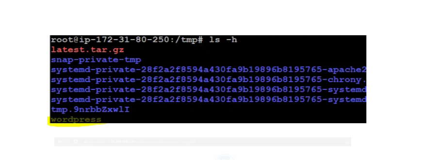
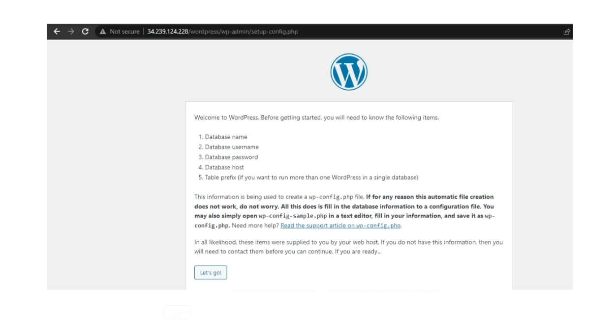
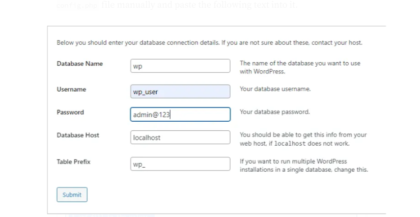
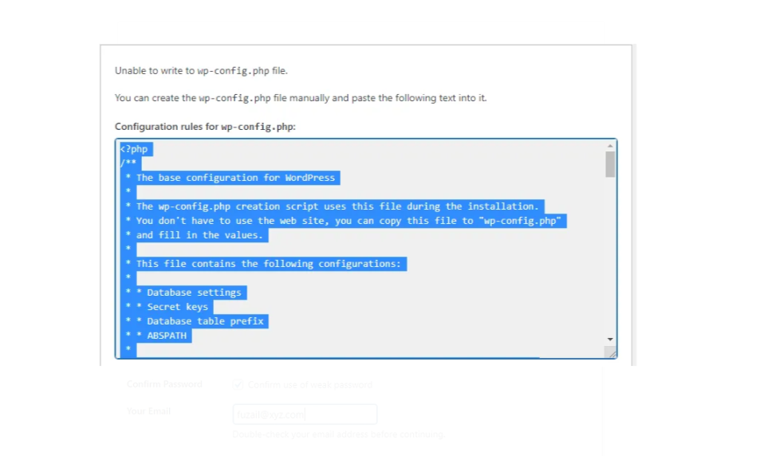
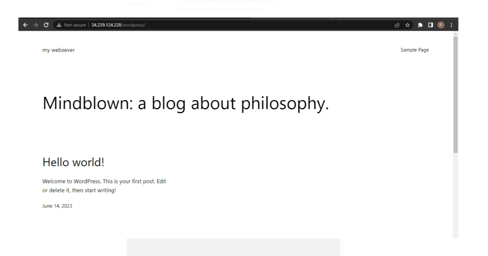
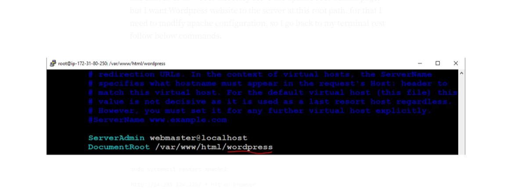
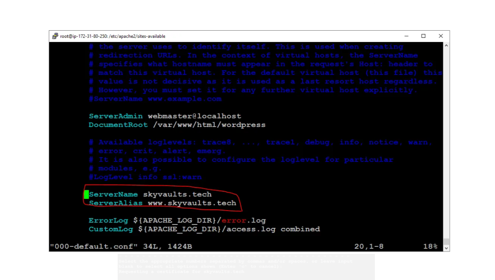
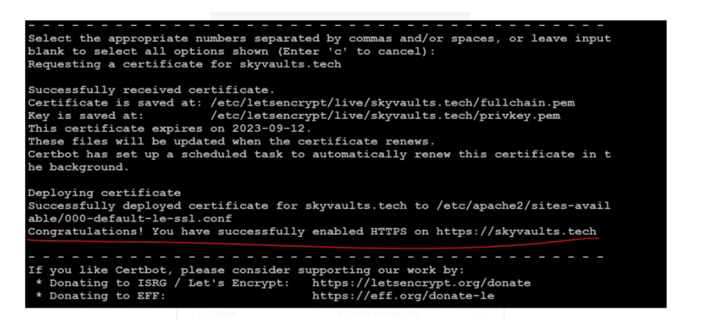

### Hosting a Wordpress Website on AWS

This is a guide to hosting a Wordpress website on AWS. The guide will cover the following topics:

- Creating an EC2 instance
- Installing Wordpress
- Installing a Let's Encrypt SSL certificate
- Configuring a domain name

## Architecture Diagram of This Project


Step 1: Launch an instance

- Ami : Ubuntu Server 18.04 LTS (HVM), SSD Volume Type
- Instance Type : t2.micro
- Configure Instance Details :
  - Network : default
  - Subnet : default
  - Auto-assign Public IP : Enable
- Key pair : PPK file or PEM file
- Firewall Rule : HTTP, HTTPS, SSH
- Configuration Storage : 8 GB, gp2


Step 2: Assoicate Elastic IP


Setp 3: Connect to the instance using SSH client (Putty) or Windows PowerShell (SSH)

```
ssh -i "keypair.pem" ec2-user@followed by public IP
```


Step 4: Install Apache2 and mysql-server on the instance

- Go to the repository and clone the repository

```
https://github.com/Amul-Thantharate/wordpress-website-host-aws.git
```

- Then Go to the wordpress-website-host-aws directory and go to the Setup-Files

```
cd wordpress-website-host-aws/Setup-Files
1. sudo chmod +x 1-setup-mysql-server.sh
2. sudo ./1-setup-mysql-server.sh
        or
Run one by one command in the terminal
```

- These will setup your mysql-server and create a database and user for wordpress

Step 5: Download and configure wordpress

```
cd wordpress-website-host-aws/Setup-Files
1. sudo chmod +x 2-setup-wordprses.sh
2. sudo ./2-setup-wordpress.sh
        or
Run one by one command in the terminal

```





- It threw an error, doesn't matter copy the Configuration rules. create the wp-config.php file manually and paste the following text into it.



- Then it will ask for the site title, username, password, email. Fill it and click on Install Wordpress.



- I dont want my website go to the subpath (34.239.124.228/wordpress) like this. I want it to serve on root directory like this (34.239.124.228) like this, as of now root directory serve the apache root default page, but I want Wordpress website to the server at this root path. for that I need to modify apache configuration, so I go back to my terminal rest follow below commands.



- Change document root to /var/www/html/wordpress

Step 6: Link Domain name to our website

- First off all we need to buy a domain name from any domain name provider like GoDaddy, Namecheap, etc.
- Then go to the AWS Route 53 and create a hosted zone and add a record set for your domain name.
- Then go to the domain name provider and change the nameserver to the AWS Route 53 nameserver.
- Then go to the AWS Route 53 and add a record set for your domain name.
- Then go to the terminal and follow the below commands.
- Point your domain name to your public IP address as an A record.

```bash
cd wordpress-website-host-aws/Setup-Files
1. sudo chmod +x 3-link-domain-to-website.sh
2. sudo ./3-link-domain-to-website.sh
        or
Run one by one command in the terminal

```



- Then go to the browser and type your domain name and hit enter.

Step 7: Secure Connection (HTTPS)

- Go to the terminal and follow the below commands.

```bash
cd wordpress-website-host-aws/Setup-Files
sudo chmod +x 4-secure-connection.sh
sudo ./4-secure-connection.sh
        or
Run one by one command in the terminal
```



## Conclusion

This is a guide to hosting a Wordpress website on AWS. The guide will cover the following topics:

- Creating an EC2 instance
- Installing Wordpress
- Installing a Let's Encrypt SSL certificate
- Configuring a domain name
- Securing the connection with HTTPS

## Thank You

Thank you for reading this guide. I hope you found it useful. If you have any questions or suggestions, please feel free to contact me.
happy coding :)
