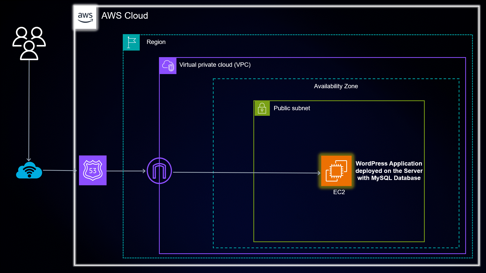
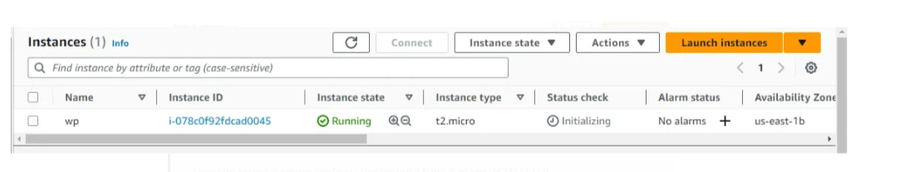
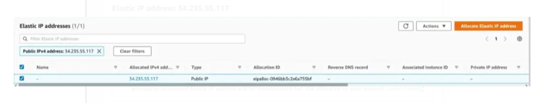
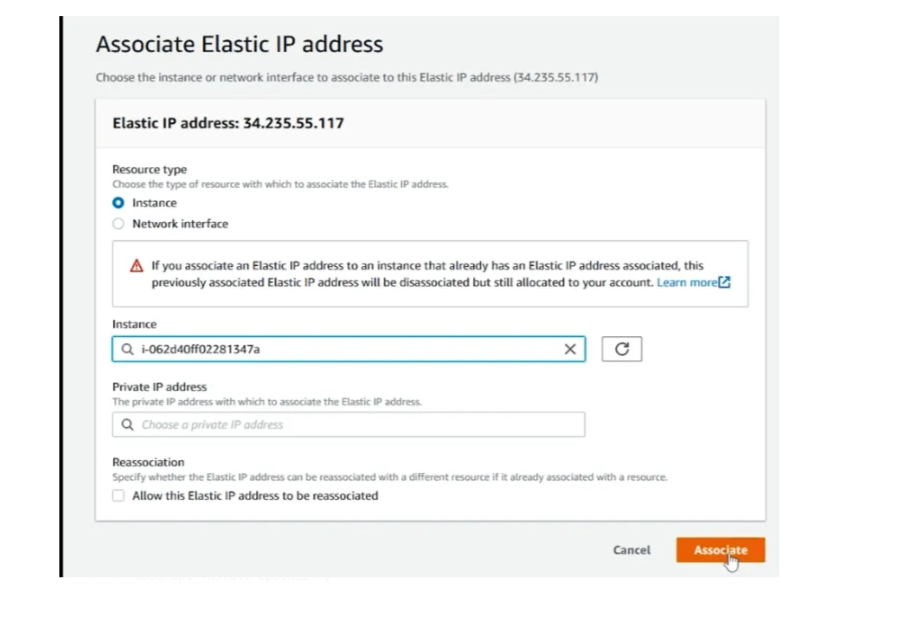
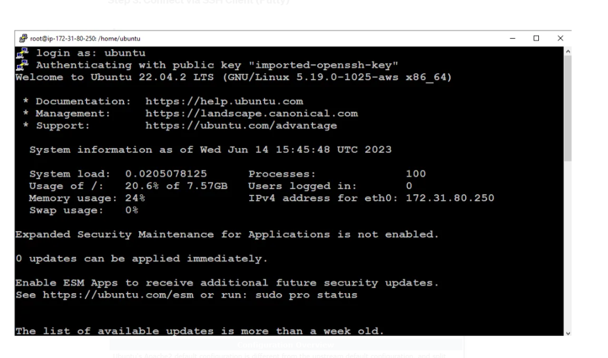

### Hosting a Wordpress Website on AWS

This is a guide to hosting a Wordpress website on AWS. The guide will cover the following topics:

- Creating an EC2 instance
- Installing Wordpress
- Installing a Let's Encrypt SSL certificate
- Configuring a domain name

## Architecture Diagram of This Project



Step 1: Launch an instance

- Ami : Ubuntu Server 18.04 LTS (HVM), SSD Volume Type
- Instance Type : t2.micro
- Configure Instance Details :
  - Network : default
  - Subnet : default
  - Auto-assign Public IP : Enable
- Key pair : PPK file or PEM file
- Firewall Rule : HTTP, HTTPS, SSH
- Configuration Storage : 8 GB, gp2



Step 2: Assoicate Elastic IP





Setp 3: Connect to the instance using SSH client (Putty) or Windows PowerShell (SSH)

ssh -i "keypair.pem" ec2-user@followed by public IP



Step 4: Install Apache2 and mysql-server on the instance

Go to the repository and clone the repository

```
https://github.com/Amul-Thantharate/wordpress-website-host-aws.git
```

Then Go to the wordpress-website-host-aws directory and go to the Setup-Files

```
cd wordpress-website-host-aws/Setup-Files
1. sudo chmod +x 1-setup-mysql-server.sh
2. sudo ./1-setup-mysql-server.sh
        or
Run one by one command in the terminal
```

These will setup your mysql-server and create a database and user for wordpress
